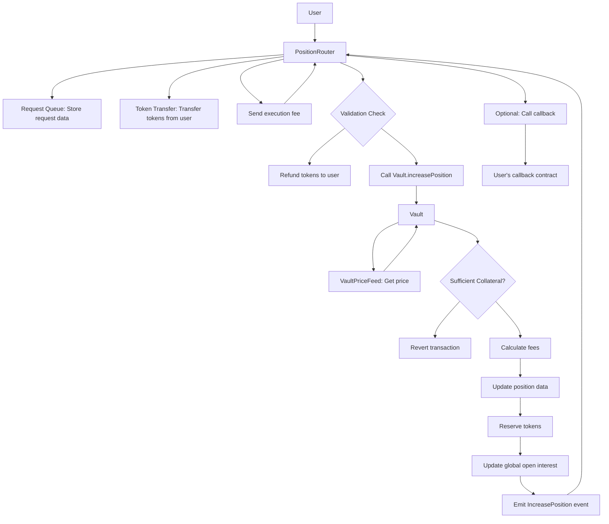
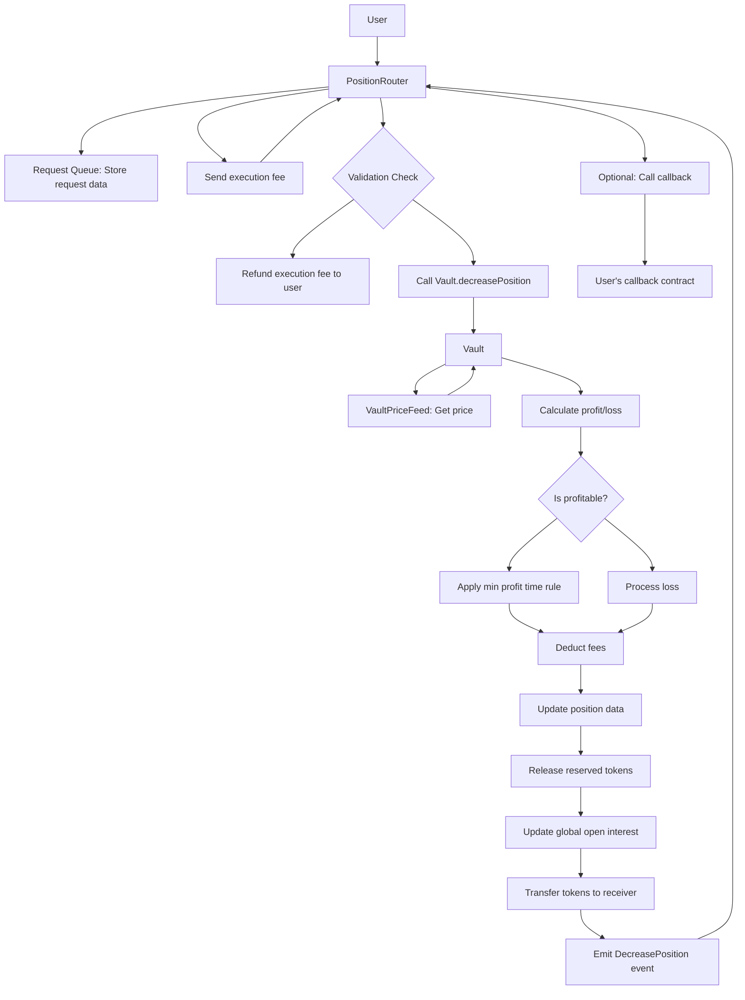
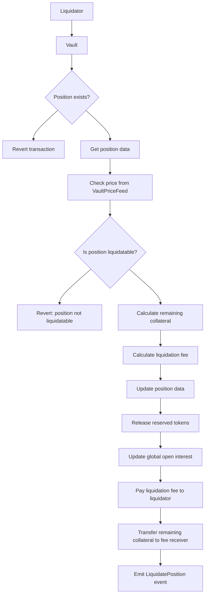

# Vault

The Vault is the central contract in the Satoshi Perps protocol that manages all positions, collateral, liquidations, and funding rates. It serves as the primary storage layer for the protocol's state.

## Contract Overview

The Vault handles:
- Storing and managing user positions
- Tracking collateral for all positions
- Executing position increases and decreases
- Managing funding rates
- Handling liquidations
- Tracking global open interest

<Info>
The Vault contract is designed with modularity in mind, delegating certain functions to companion contracts like VaultUtils.
</Info>

## Key Functions

### Position Management

```solidity
function increasePosition(
    address _account,
    address _collateralToken,
    address _indexToken,
    uint256 _sizeDelta,
    bool _isLong
) external;
```

Increases the size of a user's position. This function is called by position management contracts like PositionRouter and PositionManager.

```solidity
function decreasePosition(
    address _account,
    address _collateralToken,
    address _indexToken,
    uint256 _collateral,
    uint256 _sizeDelta,
    bool _isLong,
    address _receiver
) external returns (uint256);
```

Decreases the size of a user's position, optionally withdrawing collateral.

### Liquidation

```solidity
function liquidatePosition(
    address _account,
    address _collateralToken,
    address _indexToken,
    bool _isLong,
    address _feeReceiver
) external;
```

Allows liquidators to liquidate undercollateralized positions.

### Position Data Access

```solidity
function getPosition(
    address _account,
    address _collateralToken,
    address _indexToken,
    bool _isLong
) external view returns (
    uint256 size,
    uint256 collateral,
    uint256 averagePrice,
    uint256 entryFundingRate,
    uint256 reservedAmount,
    uint256 realisedPnl,
    bool hasRealisedProfit,
    uint256 lastIncreasedTime
);
```

Retrieves the details of a user's position. Note that `realisedPnl` is stored internally as an `int256` to allow for negative values, but is returned as a `uint256` with a boolean flag to indicate profit/loss.

### Pool and Token Management

```solidity
function directPoolDeposit(address _token) external;
```

Allows direct deposits to the pool without minting USDG tokens.

```solidity
function buyUSDG(address _token, address _receiver) external returns (uint256);
```

Buys USDG tokens with the provided token.

```solidity
function sellUSDG(address _token, address _receiver) external returns (uint256);
```

Sells USDG tokens for the specified token.

```solidity
function swap(address _tokenIn, address _tokenOut, address _receiver) external returns (uint256);
```

This function is implemented but is currently disabled. Direct token swapping is not available, but users can still swap tokens indirectly by using `buyUSDG` and `sellUSDG` functions in sequence.

### Token Configuration

```solidity
function setTokenConfig(
    address _token,
    uint256 _tokenDecimals,
    uint256 _tokenWeight,
    uint256 _minProfitBps,
    uint256 _maxUsdgAmount,
    uint256 _maxLongOiAmount,
    uint256 _maxShortOiAmount,
    bool _isStable,
    bool _isShortable
) external;
```

Configures a token with its parameters including decimals, weight, profit thresholds, and open interest limits.

```solidity
function clearTokenConfig(address _token) external;
```

Clears the configuration for a token, effectively disabling it in the protocol.

### Upgradability

```solidity
function upgradeVault(address _newVault, address _token, uint256 _amount) external;
```

Transfers tokens from this Vault to a new Vault during an upgrade process.

## Position Mechanics

The Vault tracks positions using a multi-key approach:
- Account address
- Collateral token
- Index token
- Direction (long/short)

Each position contains:
- Size (the total position size in USD)
- Collateral (amount of collateral in USD)
- Average entry price
- Entry funding rate
- Reserved amounts
- Realized PnL (stored as int256 to allow for negative values)
- Last increased timestamp

## Open Interest Tracking

The Vault tracks and limits the total open interest for each token:

```solidity
mapping(address => uint256) public maxLongOpenInterest;
mapping(address => uint256) public maxShortOpenInterest;
mapping(address => uint256) public longOpenInterest;
mapping(address => uint256) public shortOpenInterest;
```

When increasing a position, the Vault:
1. Adds the size delta to the token's longOpenInterest (for longs) or shortOpenInterest (for shorts)
2. Validates that the new open interest doesn't exceed maxLongOpenInterest or maxShortOpenInterest
3. Reverts the transaction if limits are exceeded

When decreasing or liquidating a position, the open interest is reduced accordingly.

Open interest limits are set in the `setTokenConfig` function:

```solidity
function setTokenConfig(
    address _token,
    uint256 _tokenDecimals,
    uint256 _tokenWeight,
    uint256 _minProfitBps,
    uint256 _maxUsdgAmount,
    uint256 _maxLongOiAmount,
    uint256 _maxShortOiAmount,
    bool _isStable,
    bool _isShortable
) external;
```

This function configures token parameters including maximum open interest limits for both long and short positions.

### Leverage Calculation

Leverage is calculated as `size / collateral`. For example:
- With 1 ETH collateral worth $2000
- Position size of $10,000
- Leverage = 5x

## Funding Rate Mechanism

The Vault implements a dynamic funding rate to balance longs and shorts:

```solidity
function updateCumulativeFundingRate(address _collateralToken, address _indexToken) public;
```

Funding rates are calculated based on:
- The difference between long and short open interest
- Elapsed time since the last update
- Funding rate factors configured in the contract

## Liquidation Mechanism

Positions become eligible for liquidation when:
- Position leverage exceeds maximum allowed leverage
- Collateral minus losses falls below maintenance margin requirement

<Warning>
Liquidators can call `liquidatePosition()` on eligible positions and receive a portion of the remaining collateral as a reward.
</Warning>

## Integration Points

The Vault integrates with:
- **PositionRouter**: For executing position changes through a queue-based system
- **PositionManager**: For direct position management with role-based access
- **OrderBook**: For executing limit orders
- **VaultUtils**: For utility functions related to positions and fees
- **VaultPriceFeed**: For price feed data used in position calculations

## Security Considerations

The Vault implements several security features:
- Access controls for critical functions
- Circuit breakers for maximum position sizes
- Slippage protection
- Oracle price validation
- Reentrancy protection

<Note>
All sensitive functions are protected by the `nonReentrant` modifier to prevent reentrancy attacks.
</Note>

## Position Flow Charts

### Opening a Position

The following flow chart illustrates the complete process of opening a position through the protocol:



**Position Opening Steps:**
1. User calls `createIncreasePosition` on PositionRouter
2. PositionRouter stores request data in queue
3. PositionRouter transfers tokens from user
4. Keeper calls `executeIncreasePosition` on PositionRouter
5. PositionRouter validates request parameters
6. If invalid, tokens are refunded to user
7. If valid, calls `Vault.increasePosition`
8. Vault gets price from VaultPriceFeed
9. Vault verifies sufficient collateral
10. Vault calculates fees, updates position data
11. Vault reserves tokens and updates open interest
12. PositionRouter executes optional callback
13. PositionRouter sends execution fee to keeper

### Closing a Position

This flow chart shows the process of closing or decreasing a position:



**Position Closing Steps:**
1. User calls `createDecreasePosition` on PositionRouter
2. PositionRouter stores request data in queue
3. Keeper calls `executeDecreasePosition` on PositionRouter
4. PositionRouter validates request parameters
5. If invalid, execution fee is refunded to user
6. If valid, calls `Vault.decreasePosition`
7. Vault gets price from VaultPriceFeed
8. Vault calculates profit or loss
9. If profitable, applies minimum profit time rule
10. If not, processes the loss
11. Deducts fees and updates position data
12. Releases reserved tokens and updates open interest
13. Transfers tokens to the receiver
14. PositionRouter executes optional callback
15. PositionRouter sends execution fee to keeper

### Liquidation Process

This flow chart illustrates the liquidation process for underwater positions:



**Liquidation Steps:**
1. Liquidator calls `liquidatePosition` on Vault
2. Vault checks if the position exists
3. If it doesn't exist, reverts the transaction
4. If it exists, gets the position data
5. Checks current price from VaultPriceFeed
6. Determines if position is liquidatable based on leverage and collateral
7. If not liquidatable, reverts the transaction
8. If liquidatable, calculates remaining collateral
9. Calculates liquidation fee for the liquidator
10. Updates position data (zeroes out the position)
11. Releases reserved tokens
12. Updates global open interest
13. Pays liquidation fee to the liquidator
14. Transfers remaining collateral to fee receiver
15. Emits LiquidatePosition event

## Example: Position Lifecycle

<Steps>
  <Step title="Opening a Position">
    A trader wants to open a 5x long ETH position with 1 ETH as collateral.
    
    1. The trader calls the PositionRouter's createIncreasePosition function
    2. The request is queued for execution
    3. When executed, the Vault records a new position with:
       - Size: $10,000 (assuming ETH price of $2,000)
       - Collateral: $2,000
       - Average Price: Current ETH price
  </Step>
  <Step title="Managing the Position">
    The trader decides to add more collateral to reduce leverage.
    
    1. Trader calls PositionRouter's createIncreasePosition with just collateral (no size delta)
    2. The Vault updates the position's collateral
    3. New leverage: $10,000 / $3,000 = 3.33x
  </Step>
  <Step title="Closing the Position">
    The trader decides to close the position when ETH price is $2,200.
    
    1. Trader calls PositionRouter's createDecreasePosition for full size
    2. The Vault calculates profit: ($2,200 - $2,000) * (10,000 / $2,000) = $1,000
    3. Trader receives: $3,000 (collateral) + $1,000 (profit) - fees
  </Step>
</Steps>